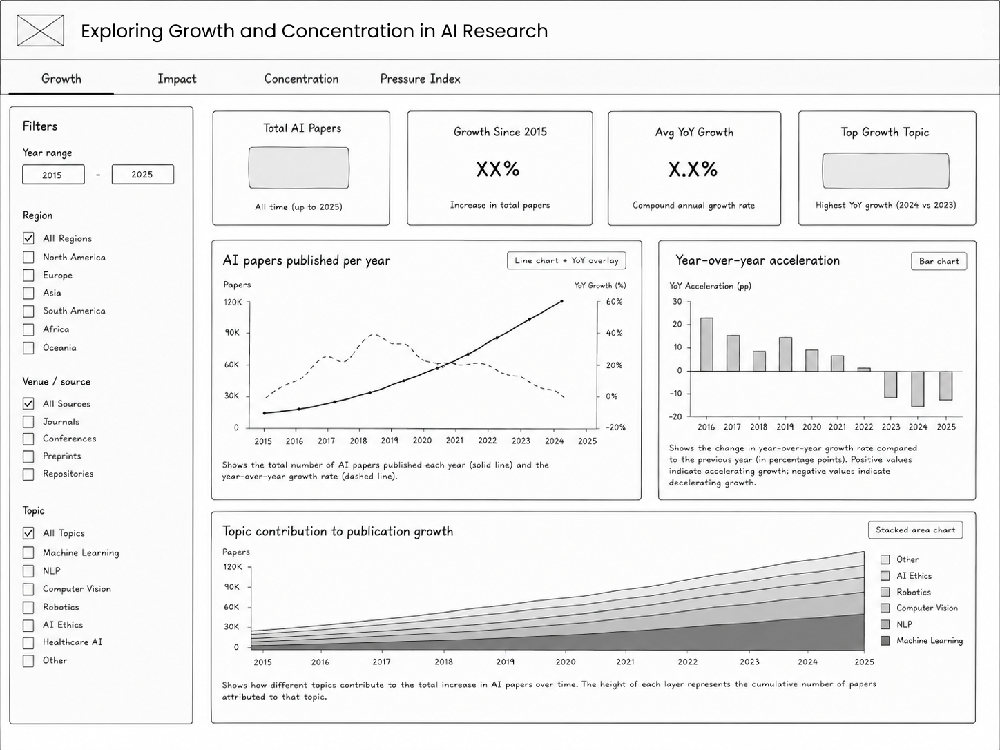
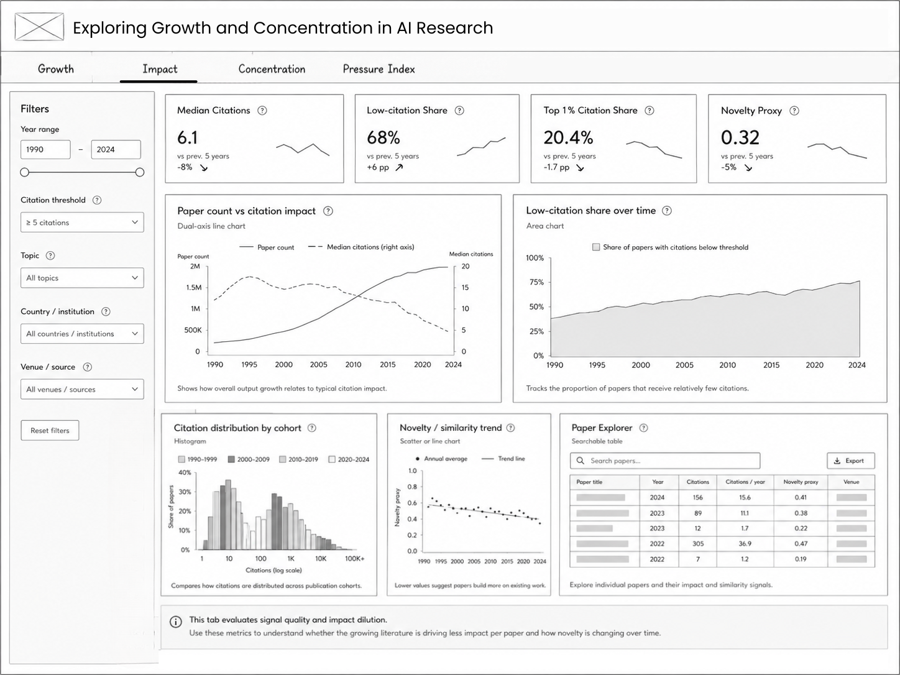
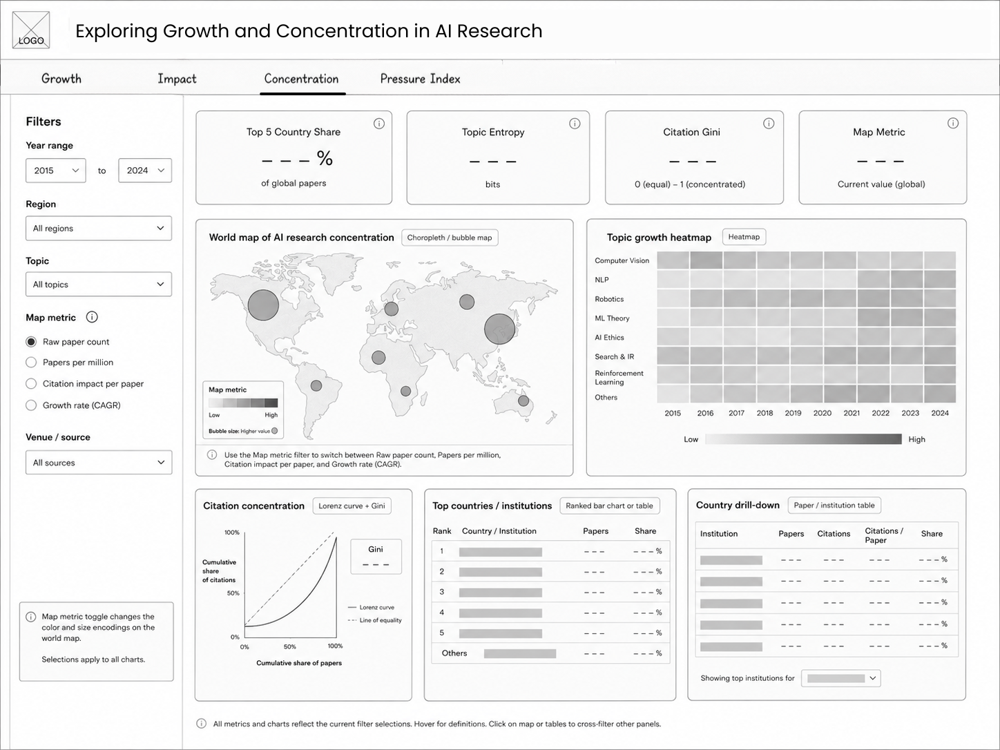

# Exploring Growth and Concentration in AI Research

COMP4010 – Data Visualization · Project 2 · Group 6

An interactive **Python Shiny** dashboard that reads a **precomputed OpenAlex
snapshot** to explore how AI research has grown, whether citation impact keeps
pace, and how output concentrates across countries, institutions and topics.

## Run the dashboard

```bash
python3 -m venv venv
source venv/bin/activate
pip install -r requirements.txt
export OPENALEX_API_KEY=your_key_here
export OPENALEX_EMAIL=your_email@example.com

python Scripts/precompute_openalex_dashboard_stats.py
# this writes data/openalex_dashboard_stats/

shiny run app.py --reload          # then open http://127.0.0.1:8000
```

The dashboard itself does not query OpenAlex live. Instead:

1. `Scripts/precompute_openalex_dashboard_stats.py` runs once and saves exact
   grouped statistics plus a stratified paper sample into
   `data/openalex_dashboard_stats/`.
2. `app.py` reads those saved files and renders the dashboard from the local
   snapshot.

## Dashboard structure

Four tabs share one sidebar of filters (currently a global year range over the
saved snapshot):

| Tab | What it answers |
|---|---|
| **Growth** | How fast is AI output growing? KPIs (total, growth %, CAGR, top-growth topic), papers-per-year with YoY overlay, YoY acceleration, and a topic-contribution stacked area. |
| **Impact** | Does impact keep up with volume? Sample-weighted mean citations, threshold-based high-impact share, citations-per-year, reference intensity, citation distributions by cohort, and a sampled Paper Explorer. |
| **Concentration** | Where does research cluster? Top-5 country share, topic entropy, map views, topic heatmap, country concentration curve, country/institution drill-down tables, and OA-structure charts. |
| **Pressure Index** | A composite indicator combining growth, impact dilution, geographic concentration and topic crowding into one 0–100 score over time. |

### Chart variety

Line, bar (vertical + horizontal), stacked area, histogram, pie/donut,
choropleth map, heatmap, Lorenz curve and radar.

## Project layout

```
app.py                 # Shiny entry point (navbar + shared sidebar + server wiring)
src/                   # one module per concern, for easy tracking
  data.py              # load the precomputed OpenAlex snapshot
  geo.py               # ISO-2 -> name / ISO-3 / region / population lookup
  metrics.py           # Gini, Lorenz, entropy, CAGR, YoY helpers
  theme.py             # shared Plotly styling
  mod_growth.py        # Growth tab UI + server
  mod_impact.py        # Impact tab UI + server
  mod_concentration.py # Concentration tab UI + server
  mod_pressure.py      # Pressure Index tab UI + server
Scripts/               # one-shot snapshot precompute helpers
Dataset/               # older CSV exports kept for reference only
Notebooks/             # crawl, preprocessing/EDA, and metric-derivation notebooks
Proposal/              # proposal PDF + wireframes
```

## Data note

The snapshot precompute uses **exact OpenAlex grouped counts wherever
possible**. Only the views that fundamentally need row-level citation or paper
metadata rely on the saved stratified sample. This keeps the dashboard cheap to
refresh while preserving the main story of each tab.

---

## 1. Project Overview

This project explores how AI research has evolved during the rapid expansion of modern artificial intelligence, particularly after the rise of deep learning, generative AI, and large language models. Instead of only measuring publication volume, the project investigates how scientific attention, citation impact, topic concentration, and institutional influence change over time.

The final product will be an interactive Python Shiny dashboard that guides users through four connected analytical views: publication growth, research impact, concentration, and research pressure indicators. 

### The project aims to answer the main Research Question:

> How is the global AI research landscape structurally organized across different subfields, institutions, and geographies, and how have these scientific trajectories shifted over time?

---

## 2. Motivation

AI research is expanding too fast for researchers to track manually. This project is motivated by the need to provide a comprehensive, interactive map of the AI ecosystem, helping users identify not just how much AI research is growing, but who the hot spots are, who is leading them, and which domains are gaining traction

This project is motivated by the need to move beyond simple publication counts and examine how scientific attention and influence are distributed within the AI research ecosystem. The dashboard focuses on identifying patterns such as citation concentration, topic crowding, institutional dominance, and shifts in research attention over time.

---
## 3. Dataset Description

The primary dataset will be collected from the **OpenAlex API**, an open scholarly database containing metadata on academic publications, citations, authors, institutions, venues, and research topics. The current sample dataset contains approximately 4,000 AI-related papers published between 2015 and 2026, with plans to expand to around 20,000–50,000 papers using broader AI-related search terms such as *“machine learning,” “deep learning,”* and *“large language model.”*

The dataset comprises several interconnected dimensions, structured to support multi-layered exploration:

- **Publication metadata & Impact metrics:**  
  Paper title, publication year, venue/source, citation counts, and forward/backward citation links to measure scientific attention.

- **Hierarchical Research Context (Topics & Fields):**  
  Instead of relying on noisy, unstandardized raw keywords, the project leverages OpenAlex’s structured Concept/Topic Taxonomy. This hierarchical system allows for multi-level filtering and drill-down analysis:
  
  - *Level 0 & 1 (Macro Domain):*  
    Broad fields such as Computer Science and Artificial Intelligence.
  
  - *Level 2 & 3 (Subfields & Methods):*  
    Specialized sub-domains like Deep Learning, Natural Language Processing (NLP), Computer Vision, Reinforcement Learning, and Generative AI.

  This structured taxonomy enables the dashboard to group related papers consistently and track macro-to-micro transitions smoothly over time.

- **Contributor metadata:**  
  Authors, institutions, and countries.

To augment frontier-AI context, optional supplementary data may be integrated from the Epoch AI Models Database and the Stanford AI Index, linking academic publication trends with real-world model scaling properties.

Overall, the dataset combines numerical, categorical, temporal, network-based, and textual data, making it suitable for both statistical analysis and machine-learning-based exploration of AI research trends, concentration, and scientific influence.

---

## 4. Visualization Challenges
This dataset is non-trivial to visualize because it contains multiple interconnected dimensions, including publication growth over time, highly skewed citation distributions, overlapping research topics, institutional concentration, and textual similarity across papers.

The key design challenge is to avoid creating a static bibliometric dashboard. The dashboard must support a visual reasoning workflow: users first see the growth pattern, then test whether impact keeps up, then inspect concentration, and finally explore how different pressure signals combine. This requires linked filtering, drill-down tables, normalized metrics, and explainable analytical components
---

## 5. Planned Dashboard Structure

### Growth View

Tracks the expansion of AI research over time through publication volume, topic growth, and temporal trends.



---

### Impact View

Explores citation distributions, scientific influence, and research impact concentration across papers and venues.



---

### Concentration View

Visualizes institutional, geographic, and topic-level concentration within the AI research ecosystem.



---

## 6. Team Members & Responsibilities

| Team Member | Student ID | Role | Responsibilities |
|---|---|---|---|
|  Nguyen Thi Phuong Thao | V202401781 | Data Collection & EDA | OpenAlex API collection, data preprocessing, cleaning, exploratory data analysis (EDA), and dataset management |
| Le Thao Vy | V202401694 | Machine Learning & NLP Analysis | Topic modeling, clustering, textual similarity analysis, novelty exploration, and ML-based analytical methods |
| Ngo Thanh An | V202401748 | Visualization Development | Interactive charts, dashboard visualizations, map visualizations, and Python Shiny implementation |
| Nguyen Hoang Nam | V202401647 | Storytelling & Dashboard Design | Dashboard structure, narrative flow, UI/UX consistency, presentation materials, and storytelling integration |
---

## 7. Project Plan And Status

## Project Timeline
- **May 18** — Proposal Submission

---

### Phase 1 — Data Scaling & Pipeline Engineering  
**May 19 – May 24**

### Phase 2 — Core Analytics & Machine Learning  
**May 25 – May 31**

### Phase 3 — Dashboard Integration & UI/UX Optimization  
**June 1 – June 4**

### Phase 4 — Testing, Documentation & Finalization  
**June 5 – June 7**

---

- **June 7** — Final Submission & Presentation

### Current Progress
- Proposal completed
- Initial OpenAlex dataset collected
- Dashboard wireframe designed
- Preliminary EDA in progress

### Future Development
- Expand dataset size
- Build interactive dashboard
- Implement NLP-based similarity analysis
- Develop research pressure indicators
